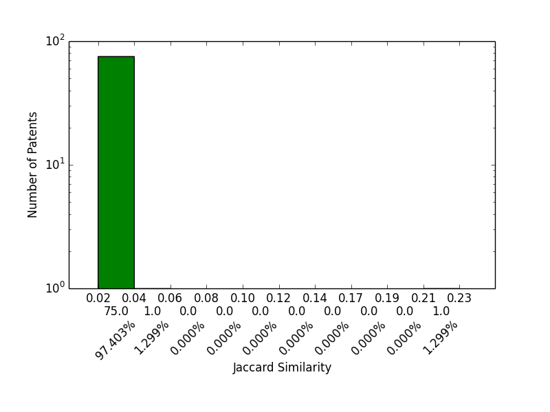

# Patent CounterFactual tool

The point of this tool is to provide a list of Patent IDs and a set of date
ranges and receive back a list of patents whose tag-based similarity is within
a given threshold.

We specify a configuration file like the following

```
[Config]
WindowBefore = 01 Jan 2007
WindowAfter = 01 Jan 2013
FocalDate = 01 Jan 2010
DistanceThreshold = .95
DistanceMetric = Jaccard
Patentcorpus = raw_tags.csv
; DateLayout uses Go's canonical format time
DateLayout = 02 Jan 2006
```

* *WindowBefore*: lower bound date we want to search
* *WindowAfter*: upper bound date we want to search
* *FocalDate*: date in between the previous two dates. This defines the "before" and "after" ranges
* *DistanceThreshold*: 1.0 = no shared tags, 0.0 = all shared tags. Uses JaccardDistance
* *Patentcorpus*: relative path to a CSV file containing patent records. Assumes the CSV file
    follows the schema `patent ID,application date,number of tags,space separated list of tags`
* *DateLayout*: if you leave dates in the format of "DD Month YYYY", then you don't have to
    worry about this. Otherwise, look at the [Golang time package](http://golang.org/pkg/time/)

Name this file `config.ini`.

As input, we give the program a path to a filename containing a list of patent
numbers, one per line.

Run the program as following:

```
go run patent_cf.go <path-to-patent-list.csv>
```

You'll get an output file called `counterfactual.out`, which will, for the "before" and "after"
date ranges, give you a list of the following:

patent id (from the file you specified), space separated list of similar patents within the date range

This will look something like the following

```
Between Jan 01 2007 to Jan 01 2010
8318997, 7628137
5181968, 7923341
6273673, 7872592
6290180, 7628928 7992528
8196550, 8061999
Between Jan 01 2010 to Jan 01 2013
8318997, 8070835
```

# Histogram Generator

For a given patent, it is helpful to obtain similarity histograms of patents that are applied for
both before and after.

We can generate CSV files of these similarity scores for a given patent:

```
go run generateHistogramData.go raw_tags.csv 4303061
```

This will generate `after.csv` and `before.csv`, which each have the schema

```
patent number, jaccard similarity
```

where the jaccard distance is 1.0 if the patents have no shared tags, and 0.0
if they have all shared tags. The Porter word stemming algorithm is applied.

After this output is generated, we can create the histograms by running

```
python generateHistograms.py before.csv after.csv
```

This will generate two nice histograms in `before.png` and `after.png`
that will look something like the following




## Timeseries

An additional output of `generateHistogramData.go` are `afterTS.csv` and `beforeTS.csv`,
which are CSV files of timeseries data with schema:

```
patent application date, jaccard similarity
```

These can be plotted using the script

```
python generateTSHistograms.py beforeTS.csv afterTS.csv
```

Sample output coming
